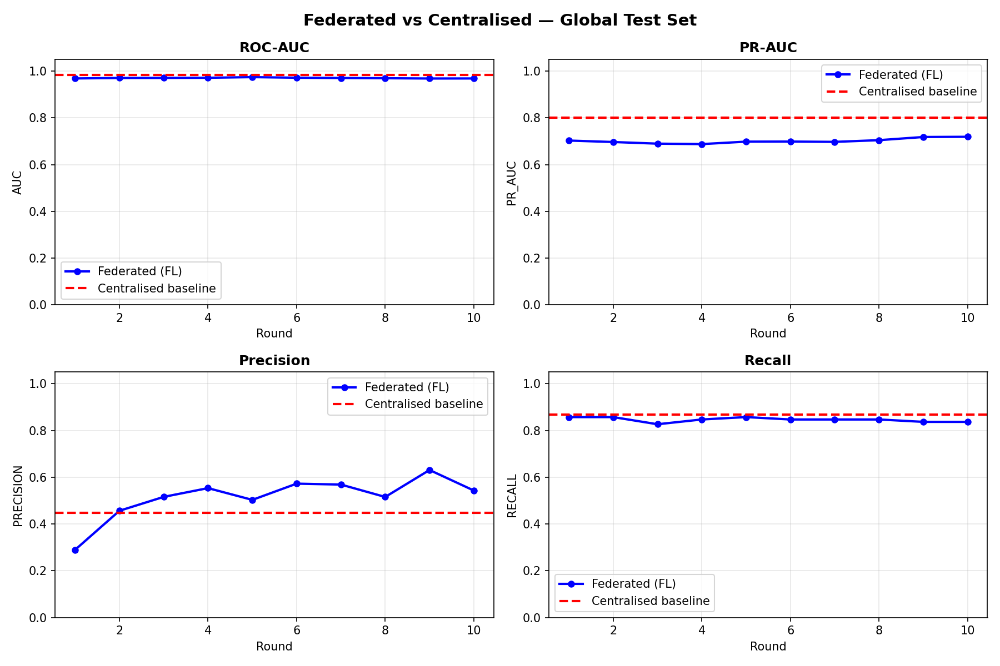
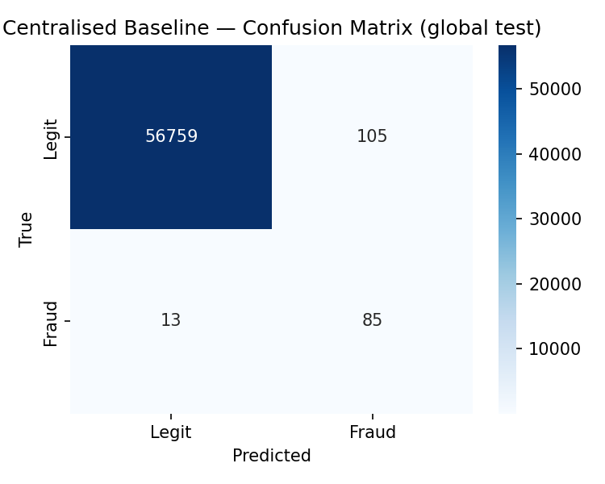

# 🏦 Federated Fraud Detection

> A PyTorch + Flower pipeline that trains one credit card fraud detection model across **5 simulated banks** — without any bank sharing its raw transactions. Only model weights move between clients and server, using the **FedAvg** algorithm. Federated and centralised models are compared **fairly on the same leakage-free global test set**.

Built as a Federated Learning portfolio project by **Sai Sura** — Master's student in Intelligent Interactive Systems, Universität Bielefeld. Made for the L.E.A.D.D. (Learning from Distributed Data) seminar.


---

## 📊 Results (global test set, real fraud ratio)

All numbers below are from a real run (`python run_simulation.py`, seed 42) on the **global test set**: 56,962 transactions with 98 fraud cases (0.17%) that no model was trained on and that was **never oversampled**.

| Metric | Federated (FL, 5 banks) | Centralised baseline |
|--------|------------------------:|---------------------:|
| **ROC-AUC** | **0.9684** | 0.9827 |
| **PR-AUC** | **0.7189** | 0.8019 |
| F1 (threshold 0.5) | 0.6586 | 0.5903 |
| Precision (threshold 0.5) | 0.5430 | 0.4474 |
| Recall (threshold 0.5) | 0.8367 (82 of 98 frauds) | 0.8673 (85 of 98 frauds) |

**How to read this**

- **ROC-AUC:** federated learning reaches almost the same ranking quality as centralised training (0.968 vs 0.983).
- **PR-AUC** is the most honest metric for very imbalanced data like fraud. The gap of about **0.08** is the "price of privacy": the banks never share raw data.
- **F1 / Precision / Recall** depend on the decision threshold (0.5). At this threshold, the centralised model catches 3 more frauds but raises more false alarms; the FL model is more precise. These threshold metrics show a different trade-off, not that FL is "better".





---

## 🐞 Leakage Fix: Why the Numbers Are Honest

The first version of this project reported very high precision and F1. While reviewing the pipeline, I found **three evaluation problems** and fixed them:

| Problem | Why it was wrong | Fix |
|---------|------------------|-----|
| **SMOTE before the train/validation split** | Synthetic fraud samples were created from validation data, so the model was validated on near-copies of what it trained on. | Each bank splits **first**, then applies SMOTE to its **local training part only**. |
| **Validation on SMOTE-balanced data (~50% fraud)** | Precision and F1 look much better at 50% fraud than at the real 0.17%. The FL and centralised models were even tested on different kinds of data. | A **global test set** (20%, stratified, real ratio) is held out before anything else. Both models are evaluated on it. |
| **Scaler fitted on all data** | `Time` and `Amount` scaling used statistics from the test data (small leak). | `StandardScaler` is fitted on the **train pool only**. |

After the fix, precision dropped and PR-AUC is lower — but now the results reflect how the model would work on real, imbalanced transactions.

---

## 🎯 Problem This Solves

Banks want to detect fraud better by training on more data, but transaction records are highly private. GDPR, banking secrecy laws and competition stop banks from pooling raw data in one place.

**Federated Learning (FL)** solves this: instead of moving data to one place, the model moves to the data. Each bank trains locally on its own transactions, and only the trained *weights* are sent to a central server. The server averages the weights from all banks (FedAvg) into one global model and sends it back. This repeats for several rounds, and no bank ever exposes a single raw transaction.

This project simulates that setup end-to-end: 5 simulated banks, one Flower FedAvg server, and a centralised baseline to measure how much privacy costs in performance.

---

## 🔍 What It Does

| Step | What Happens | Where |
|------|--------------|-------|
| **Global split** | 20% stratified **global test set** held out first (real fraud ratio, never oversampled) | `utils/data_loader.py` |
| **Preprocessing** | Scales `Time` and `Amount` with a scaler fitted on the train pool only | `utils/data_loader.py` |
| **Partitioning** | Splits the train pool across N banks — `non_iid` (time windows, default) or `iid` (same fraud ratio) | `utils/data_loader.py` |
| **Local split + imbalance** | Each bank: local train/validation split, then SMOTE on local train only, plus weighted loss (`pos_weight`) | `utils/data_loader.py`, `run_simulation.py` |
| **Local training** | Each bank trains the same MLP on its own data for 3 epochs per round | `run_simulation.py` (client) |
| **Aggregation** | Flower's `FedAvg` averages client weights, weighted by data size | `run_simulation.py` |
| **Evaluation** | Every round: global model on the **global test set** (ROC-AUC, PR-AUC, F1, Precision, Recall) + local validation per bank | `run_simulation.py` |
| **Baseline** | One model trained on the full train pool (same imbalance handling), tested on the same global test set | `run_centralised_baseline` |

---

## 🏗️ Architecture

```
                   ┌─────────────────────┐
                   │   creditcard.csv    │
                   │  (Kaggle, 284,807)  │
                   └──────────┬──────────┘
                              ▼
                   ┌─────────────────────┐
                   │  Stratified split   │
                   └───────┬───────┬─────┘
             80% train pool│       │20%
                           ▼       ▼
          ┌─────────────────┐   ┌──────────────────────┐
          │ Scaler (fit on  │   │  GLOBAL TEST SET     │
          │ train pool only)│   │  real ratio, never   │
          └────────┬────────┘   │  oversampled         │
                   ▼            └──────────┬───────────┘
          ┌─────────────────┐              │
          │ Partition into  │              │
          │ 5 banks (non-IID│              │
          │ time windows)   │              │
          └────────┬────────┘              │
     ┌─────────────┼──────────────┐        │
     ▼             ▼              ▼        │
┌──────────┐ ┌──────────┐   ┌──────────┐   │
│ Bank 0   │ │ Bank 1   │...│ Bank 4   │   │
│ train/val│ │ train/val│   │ train/val│   │
│ SMOTE on │ │ SMOTE on │   │ SMOTE on │   │
│ train    │ │ train    │   │ train    │   │
│ Local MLP│ │ Local MLP│   │ Local MLP│   │
└────┬─────┘ └────┬─────┘   └────┬─────┘   │
     └────────────┼──────────────┘         │
                  ▼                        │
       ┌─────────────────────┐             │
       │  Flower FedAvg      │  ← weighted average of weights
       │  server             │             │
       └──────────┬──────────┘             │
                  │  (repeat 10 rounds)    │
                  ▼                        ▼
       ┌──────────────────────────────────────────┐
       │  Global model evaluated every round on   │
       │  the global test set  ⟷  Centralised     │
       │  baseline on the SAME test set           │
       └──────────────────┬───────────────────────┘
                          ▼
               ┌─────────────────────┐
               │ results/ (JSON+PNG) │
               └─────────────────────┘
```

---

## 🚀 Quick Start

### 1. Clone the repository
```bash
git clone https://github.com/surasai060/federated_fraud_detection.git
cd federated_fraud_detection
```

### 2. Create a virtual environment and install dependencies
```bash
python -m venv venv
source venv/bin/activate        # Mac/Linux
venv\Scripts\activate           # Windows

pip install -r requirements.txt
```

### 3. Get the dataset
Download `creditcard.csv` from [Kaggle Credit Card Fraud Detection](https://www.kaggle.com/datasets/mlg-ulb/creditcardfraud) and place it in `data/`. The dataset is not included in this repository.

### 4. Run the full simulation
```bash
python run_simulation.py
```
This splits and preprocesses the data, partitions it across 5 simulated banks, trains the centralised baseline, runs 10 federated rounds and saves all metrics and plots to `results/`. Results are **reproducible** (fixed seed 42).

---

## ⚙️ Options

```bash
python run_simulation.py --n_rounds 20          # more rounds
python run_simulation.py --n_clients 10         # more banks
python run_simulation.py --strategy iid         # same fraud ratio per bank
python run_simulation.py --local_epochs 5       # more local training
python run_simulation.py --no_smote             # weighted loss only
python run_simulation.py --threshold 0.7        # stricter fraud threshold
python run_simulation.py --seed 7               # different random seed
python run_simulation.py --help                 # all options
```

Partitions are re-created automatically when `--n_clients`, `--strategy` or `--no_smote` change (settings are stored in `data/partitions/meta.json`).

### Simulation backend (Ray optional)

| `--backend` | How it runs |
|-------------|-------------|
| `auto` (default) | Uses Ray if installed, otherwise `local` |
| `local` | Same Flower clients and FedAvg strategy, run in a simple loop — **no Ray needed**, works on Windows and Python 3.12 |
| `ray` | Flower `start_simulation` — needs `pip install "flwr[simulation]"` (Python ≤ 3.11 for Flower 1.8) |

---

## 🖥️ Console Output (real run, shortened)

```
=======================================================
  FEDERATED FRAUD DETECTION — SIMULATION
  Clients: 5 | Rounds: 10
  Local epochs: 3 | Strategy: non_iid | SMOTE: True | Seed: 42
=======================================================
[OK] Loaded dataset: 284,807 rows, 31 columns
     Fraud cases  : 492 (0.1727%)
     Train pool     : 227,845 rows, 394 fraud
     Global test set: 56,962 rows, 98 fraud (0.1720%, never oversampled)

  Centralised [global test] → AUC: 0.9827 | PR-AUC: 0.8019 | F1: 0.5903

[INFO] Simulation backend: local
  Round  1 [global test] → AUC: 0.9685 | PR-AUC: 0.7028 | F1: 0.4330 | Precision: 0.2897 | Recall: 0.8571
  Round  2 [global test] → AUC: 0.9705 | PR-AUC: 0.6966 | F1: 0.5957 | Precision: 0.4565 | Recall: 0.8571
  Round  3 [global test] → AUC: 0.9708 | PR-AUC: 0.6896 | F1: 0.6353 | Precision: 0.5159 | Recall: 0.8265
  Round  4 [global test] → AUC: 0.9714 | PR-AUC: 0.6877 | F1: 0.6694 | Precision: 0.5533 | Recall: 0.8469
  Round  5 [global test] → AUC: 0.9741 | PR-AUC: 0.6982 | F1: 0.6340 | Precision: 0.5030 | Recall: 0.8571
  Round  6 [global test] → AUC: 0.9716 | PR-AUC: 0.6985 | F1: 0.6831 | Precision: 0.5724 | Recall: 0.8469
  Round  7 [global test] → AUC: 0.9704 | PR-AUC: 0.6972 | F1: 0.6803 | Precision: 0.5685 | Recall: 0.8469
  Round  8 [global test] → AUC: 0.9694 | PR-AUC: 0.7045 | F1: 0.6409 | Precision: 0.5155 | Recall: 0.8469
  Round  9 [global test] → AUC: 0.9682 | PR-AUC: 0.7180 | F1: 0.7193 | Precision: 0.6308 | Recall: 0.8367
  Round 10 [global test] → AUC: 0.9684 | PR-AUC: 0.7189 | F1: 0.6586 | Precision: 0.5430 | Recall: 0.8367

  FINAL RESULTS SUMMARY  (global test set, real fraud ratio)
  Metric              Federated (FL)     Centralised
  --------------------------------------------------
  AUC                         0.9684          0.9827
  PR_AUC                      0.7189          0.8019
  F1                          0.6586          0.5903
  PRECISION                   0.5430          0.4474
  RECALL                      0.8367          0.8673
```

Saved files in `results/`:
- `fl_metrics_history.json` — global test metrics per round
- `fl_local_validation_history.json` — averaged local validation per round
- `centralised_results.json` — baseline metrics
- `fl_vs_centralised.png`, `centralised_confusion_matrix.png`

---

## 📁 Project Structure

```
federated_fraud_detection/
│
├── run_simulation.py            # MAIN FILE — runs the entire experiment
│   ├── make_client_fn           #   Flower client per bank (local train / validation)
│   ├── make_global_evaluate_fn  #   Server-side evaluation on the global test set
│   ├── run_centralised_baseline #   Non-federated comparison model
│   ├── run_local_simulation     #   Ray-free Flower simulation loop
│   └── plot_results             #   FL vs centralised charts
│
├── models/
│   └── mlp.py                   # FraudMLP: 30 → 64 → 32 → 16 → 1 (PyTorch)
│
├── clients/
│   └── fl_client.py             # Flower NumPyClient (for multi-process setups)
│
├── server/
│   └── fl_server.py             # FedAvg server (for multi-process setups)
│
├── utils/
│   └── data_loader.py           # Global split, scaling, partitioning, SMOTE after split
│
├── notebooks/
│   └── exploration.py           # Class balance, Amount/Time histograms, correlations
│
├── results/                     # Metrics (JSON) and plots (PNG)
├── data/                        # creditcard.csv goes here (not tracked in Git)
├── requirements.txt
├── GUIDE.md                     # Full setup walkthrough
└── .gitignore
```

---

## 🔗 How This Relates to Real-World Privacy-Preserving ML

| This Project | Real-World Equivalent |
|---|---|
| Simulated banks | Separate financial institutions, each with private customer data |
| FedAvg weight averaging | The core algorithm behind on-device keyboard prediction and cross-hospital medical AI |
| SMOTE + `pos_weight` | Standard techniques for fraud / rare-event detection |
| Global hold-out test set | How a model is validated before production use |
| Centralised baseline comparison | How a bank would measure the "privacy cost" of FL before adopting it |
| Non-IID time-window split | Banks each seeing a different slice of transactions, not a random shuffle |

---

## 🛠️ Tech Stack

- **Python 3.10–3.12**
- **PyTorch** — neural network (MLP) and training loop
- **Flower (flwr)** — federated clients and FedAvg strategy
- **scikit-learn** — data split, scaling, ROC-AUC, PR-AUC, F1, precision, recall
- **imbalanced-learn (SMOTE)** — class imbalance handling
- **pandas / numpy** — data loading and preprocessing
- **matplotlib / seaborn** — result plots and confusion matrix

---

## ⚠️ Limitations

- All banks run in one process on one machine — this is a simulation, not physically separate institutions.
- The decision threshold is fixed at 0.5; a real system would tune it for the bank's cost of false alarms vs missed fraud.
- The Kaggle dataset covers only two days of European card transactions with anonymised (PCA) features.
- No formal privacy guarantee (no Differential Privacy or Secure Aggregation) — FL alone only keeps raw data local.

## 🔮 Future Work

- Threshold tuning based on precision/recall trade-off per bank
- Try FedProx or FedAvgM for better robustness on non-IID data
- Add Differential Privacy or Secure Aggregation
- Run several seeds and report mean ± standard deviation
- Deploy clients on physically separate machines

---

## 👤 Author

**Sai Sura**  
Master's student in Intelligent Interactive Systems — Universität Bielefeld  
Background in SOC operations and machine learning  
📧 surasai060@gmail.com  
🔗 [LinkedIn](https://linkedin.com/in/sai-sura-945032284) · [GitHub](https://github.com/surasai060)

---

## 📜 License

MIT License — free to use, modify, and distribute.

## References

- McMahan et al. (2017). *Communication-Efficient Learning of Deep Networks from Decentralized Data.* (FedAvg)
- Beutel et al. (2020). *Flower: A Friendly Federated Learning Framework.*
- Dal Pozzolo et al. (2015). *Calibrating Probability with Undersampling for Unbalanced Classification.* (dataset)